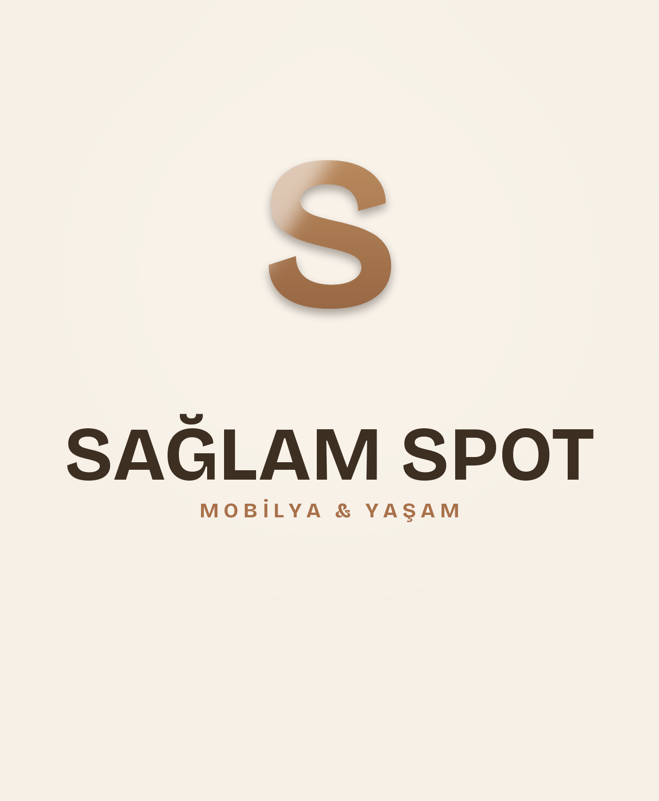
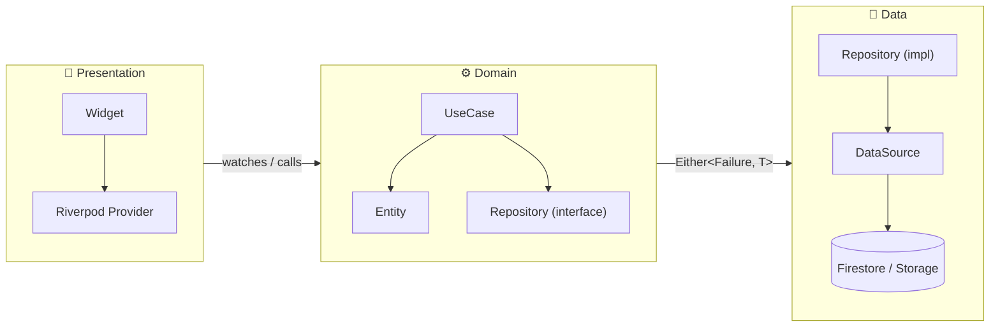

<div align="center">



# 🛋️ Sağlam Spot

### İçerenköy'ün 20 yıllık mobilya esnafından, tek kod tabanından Android + iOS + Web'e yayılan modern bir alım-satım platformu


[](https://flutter.dev)
[](https://dart.dev)
[](https://firebase.google.com)
[](https://riverpod.dev)


**🌐 [Canlı Site](https://saglamspotcu.web.app) &nbsp;·&nbsp; 📱 [Play Store](https://play.google.com/store/apps/details?id=com.ferdidrgn.saglamspot) &nbsp;·&nbsp; 🗺️ [Mağaza Konumu](https://www.google.com/maps/place/Sa%C4%9Flam+Spot)**

</div>

<br/>

## 📋 İçindekiler

<table>
<tr>
<td width="33%" valign="top">

**🚀 Başlangıç**
- [Proje Hakkında](#-proje-hakkında)
- [Öne Çıkan Özellikler](#-öne-çıkan-özellikler)
- [Kurulum](#-kurulum)
- [Ortam Değişkenleri](#-ortam-değişkenleri)

</td>
<td width="33%" valign="top">

**🏗️ Mimari**
- [Mimari Genel Bakış](#️-mimari-genel-bakış)
- [Teknoloji Yığını](#-teknoloji-yığını)
- [Proje Yapısı](#-proje-yapısı)
- [State Management](#️-state-management)

</td>
<td width="33%" valign="top">

**🔒 Operasyon**
- [Güvenlik Katmanları](#-güvenlik-katmanları)
- [SEO & Deep Link](#-seo--deep-link)
- [Deployment](#-deployment)
- [AI Agent Entegrasyonu](#-ai-agent-entegrasyonu)

</td>
</tr>
</table>

---

## 🏪 Proje Hakkında

**Sağlam Spot**, İstanbul İçerenköy'de **2012'den beri** hizmet veren bir mobilya dükkânının dijital ikizi.
Uygulama iki farklı kimliği tek bir Flutter kod tabanında birleştirir:

| 👤 Kim | 📱 Ne görür |
|---|---|
| **Müşteri** (Web + Mobil vitrin) | Sıfır & spot ürün kataloğu, filtreli arama, WhatsApp üzerinden anında iletişim, canlı harita/çalışma saatleri |
| **Esnaf/Admin** (Mobil panel) | Ürün ekleme/düzenleme, stok durumu, remove.bg destekli "stüdyo görsel" üretimi, Firebase Auth korumalı giriş |

> 💡 **Satın alma akışı yok, bilinçli bir tercih.** Uygulama sepet/ödeme değil, ürünü keşfedip esnafla doğrudan WhatsApp'tan konuşmayı önceliyor — yerel bir dükkânın gerçek alışveriş deneyimini dijitale taşıyor.

---

## ✨ Öne Çıkan Özellikler

### 🌐 Web Vitrini

```
✓ Responsive tasarım           →  Mobil / Tablet / Masaüstü için ayrı, optimize layout
✓ Dinamik ürün kataloğu        →  Sıfır & spot koleksiyonları, canlı Firestore verisi
✓ Akıllı arama & filtreleme    →  Kategori, fiyat aralığı, ürün durumu
✓ 11 dilde tam lokalizasyon    →  TR · EN · DE · RU · AR · EL · IT · KY · UK · UZ · ZH
✓ Uçtan uca SEO altyapısı      →  Dinamik meta/OG etiketleri, JSON-LD, sitemap, robots.txt
✓ İmzalı deep link'ler         →  HMAC-SHA256 korumalı, sahte ürün linki üretilemez
✓ PWA desteği                  →  manifest.json + offline-ready yapı
✓ AdSense entegrasyonu         →  Display / in-article / multiplex reklam birimleri
```

### 📱 Mobil Uygulama

```
✓ Yönetici paneli               →  Firebase Auth + Firestore admin doğrulaması
✓ Tam ürün CRUD'u               →  Ekle, düzenle, sil, çoklu görsel yükle
✓ AI destekli stüdyo görsel     →  remove.bg entegrasyonu ile arka plan temizleme
✓ AdMob reklamları              →  Banner + Native, Remote Config ile aç/kapa
✓ Çevrimdışı koruma             →  Bağlantı kesilince otomatik yeniden bağlanma ekranı
✓ Push bildirimleri             →  Firebase Cloud Messaging altyapısı
```

### 🎨 Tasarım Dili

<table>
<tr>
<td width="25%" align="center">🪵<br/><b>Sıcak & Zanaatkâr Palet</b><br/><sub>Kahverengi/toprak tonları, sahte "kurumsal mavi" yok</sub></td>
<td width="25%" align="center">🫧<br/><b>Yumuşak 3D Kartlar</b><br/><sub>Katmanlı gölgeler, yuvarlak köşeler, hover'da hafif yükselme</sub></td>
<td width="25%" align="center">🟢🟠<br/><b>Sıfır / Spot Renk Dili</b><br/><sub>Yeşil = sıfır, turuncu = spot — sitenin her yerinde tutarlı</sub></td>
<td width="25%" align="center">🌗<br/><b>Aydınlık / Karanlık Mod</b><br/><sub>Tüm renk paleti iki temada da tanımlı</sub></td>
</tr>
</table>

---

## 🏗️ Mimari Genel Bakış

Proje **Clean Architecture** katmanlarına göre kurulmuştur — her `feature`, birbirinden bağımsız test edilebilir 3 katmana ayrılır:



**Platform ayrımı**, koşullu export'larla derleme zamanında çözülür — çalışma zamanı `if` kontrolü değil, gerçek kod bölünmesi:

```dart
// home/presentation/page/wrapper/app_home_page.dart
export 'app_home_page_stub.dart'
    if (dart.library.js)  'app_home_page_web.dart'    // 🌐 Web build'e derlenir
    if (dart.library.io)  'app_home_page_mobil.dart';  // 📱 Mobil build'e derlenir
```

Bu sayede `google_mobile_ads` gibi mobil-özel paketler **web bundle'ına hiç dahil olmaz**, tersi de geçerli — hem bundle boyutu küçülür hem de platforma özgü kod tek dosyada birbirine karışmaz.

---

## 🔧 Teknoloji Yığını

<table>
<tr><td valign="top" width="50%">

**Çekirdek**

| | |
|---|---|
|  | UI framework |
|  | Dil |
|  | State management + DI |
|  | Deklaratif routing + deep link |

**Firebase**

| | |
|---|---|
| 🔐 Auth | E-posta/şifre + admin doğrulama |
| 🗄️ Firestore | Ürün veritabanı |
| 📦 Storage | Ürün görselleri |
| ⚡ Cloud Functions | remove.bg proxy + dinamik sitemap |
| 📊 Analytics | Kullanıcı davranışı |
| 🐛 Crashlytics | Çökme raporlama |
| 🚩 Remote Config | Feature flag (`adsEnabled`) |
| 🛡️ App Check | Play Integrity / DeviceCheck |

</td><td valign="top" width="50%">

**Veri & Model**

| | |
|---|---|
| `dartz` | Functional error handling (`Either`) |
| `freezed` | Immutable model sınıfları |
| `json_serializable` | JSON (de)serialization |
| `equatable` | Değer karşılaştırması |

**UI & Medya**

| | |
|---|---|
| `cached_network_image` | Görsel önbellekleme |
| `shimmer` | Yükleme animasyonları |
| `image_picker` / `file_picker` | Medya seçimi |
| `qr_flutter` | QR kod üretimi |
| `dynamic_color` | Material You |

**Reklam & Paylaşım**

| | |
|---|---|
| `google_mobile_ads` | AdMob (yalnızca mobil derlemede) |
| AdSense (HTML) | Web reklamları |
| `share_plus` | HMAC imzalı ürün paylaşımı |

</td></tr>
</table>

---

## 🔒 Güvenlik Katmanları

```mermaid
flowchart TD
    A["📲 Gelen İstek / Deep Link"] --> B{"Firebase App Check<br/>Play Integrity / DeviceCheck"}
    B -->|geçti| C{"HMAC-SHA256 İmza Doğrulaması<br/>DeepLinkSecurityEngine"}
    C -->|geçersiz| X["🚫 Güvenlik Ekranı"]
    C -->|geçerli| D{"Admin rotası mı?"}
    D -->|evet| E{"Firestore admins/&#123;email&#125;<br/>kaydı var mı?"}
    E -->|hayır| F["🔒 Anında signOut()"]
    E -->|evet| G["✅ Admin Paneli"]
    D -->|hayır| H["✅ Genel İçerik"]
```



- **🔑 İmzalı ürün linkleri** — Her `/product/{slug}-{id}?sig=...` linki `SAGLAM_SPOT_CYBER_SECURITY_KEY_2026` ile HMAC-SHA256 imzalanır; sahte/uydurma ürün ID'si ile link üretilemez.
- **👮 Çift katmanlı admin doğrulaması** — Firebase Auth başarılı olduktan **sonra**, ayrıca `admins/{email}` koleksiyonundan kontrol edilir; yetkisiz kullanıcı anında çıkarılır.
- **🗜️ Android obfuscation** — ProGuard/R8 + `isMinifyEnabled` + `isShrinkResources`, release'de `isDebuggable = false`.
- **🔐 Şifreli yerel depolama** — `flutter_secure_storage`, düz `SharedPreferences` yerine.
- **🌐 Web başlık güvenliği** — Firebase Hosting `X-Robots-Tag` özel/hassas rotalarda (`/admin`, `/cart`...) `noindex, nofollow`'a düşürülür; `robots.txt` bunları tarama dışı bırakır.

---

## 🔗 SEO & Deep Link

```
https://saglamspotcu.web.app/                        → Ana sayfa (dinamik meta + LocalBusiness JSON-LD)
https://saglamspotcu.web.app/new                      → Sıfır koleksiyon
https://saglamspotcu.web.app/spot                     → Spot fırsatlar
https://saglamspotcu.web.app/product/{slug}-{id}      → Ürün detayı (gerçek ürün adı/görseliyle OG)
https://saglamspotcu.web.app/sitemap.xml              → Statik sayfa haritası
https://saglamspotcu.web.app/sitemap-products.xml     → Firestore'dan canlı üretilen ürün haritası (Cloud Function)
```

- Sayfa geçişlerinde `SeoRouteObserver` → `document.title`, `<meta name="description">`, OpenGraph/Twitter Card ve `<link rel="canonical">` **gerçek zamanlı** güncellenir (Google, Yandex, Bing, Safari/WhatsApp paylaşım botları dahil).
- Ürün detay sayfası kendi SEO enjeksiyonunu yapar — sosyal medyada paylaşılan bir link, jenerik değil **gerçek ürün fotoğrafı/adı/fiyatıyla** önizleme gösterir.
- `functions/index.js`'teki `sitemap` Cloud Function'ı, uygulamanın kendi HMAC imzalama şemasını Node.js'te birebir replike eder — üretilen linkler mobil uygulamanın güvenlik doğrulamasından geçer.

---

## 🚀 Kurulum

**Gereksinimler:** Flutter `≥3.38.4` · Dart `≥3.5.4` · Firebase CLI · Node.js (Hosting deploy için)

```bash
# 1️⃣  Repo'yu klonla
git clone https://github.com/ferdidrgn/saglamspot.git && cd saglamspot

# 2️⃣  Bağımlılıkları yükle
flutter pub get

# 3️⃣  Kod üretimini çalıştır (freezed, riverpod_generator, json_serializable)
dart run build_runner build --delete-conflicting-outputs

# 4️⃣  Lokalizasyon dosyalarını üret (11 dil)
flutter gen-l10n

# 5️⃣  Splash screen üret
dart run flutter_native_splash:create

# 6️⃣  Çalıştır 🎉
flutter run -d chrome     # 🌐 Web
flutter run -d android    # 🤖 Android
flutter run -d ios        # 🍎 iOS
```

<details>
<summary><b>🔑 Ortam Değişkenleri</b> (git'e dahil edilmez, elle oluşturulmalı)</summary>
<br/>

| Dosya | Amaç |
|---|---|
| `android/app/google-services.json` | Android Firebase config |
| `ios/Runner/GoogleService-Info.plist` | iOS Firebase config |
| `android/key.properties` | Keystore imzalama bilgileri |
| `android/*.keystore` / `*.jks` | İmzalama anahtarı |

```properties
# android/key.properties
storePassword=<şifre>
keyPassword=<şifre>
keyAlias=<alias>
storeFile=<yol/keystore.jks>
```

</details>

---

## 📁 Proje Yapısı

```
lib/
├── 🧩 core/                 Uygulama çekirdeği
│   ├── ads/                 AdMob (mobil) + AdSense (web), koşullu export'larla ayrılmış
│   ├── config/               Router, SEO servisi, Firebase Options
│   ├── services/             Deep link, Remote Config, App Check
│   ├── theme/                Renkler, tipografi, katalog paletleri (Sıfır/Spot)
│   └── widgets/               Paylaşılan UI (ürün kartları, glassmorphism vb.)
│
├── 🗂️ features/             Özellik bazlı modüller (her biri data/domain/presentation)
│   ├── auth/                 Kimlik doğrulama
│   ├── products/             Ürün CRUD, filtreleme, admin form'ları
│   ├── search/                Arama & filtre paneli
│   ├── home/                  Ana sayfa (web/mobil ayrı implementasyon)
│   ├── info/ · sss/            Hakkımızda, SSS
│   └── settings/ · notifications/
│
├── 🌍 l10n/                  11 dilde ARB dosyaları + üretilen lokalizasyon sınıfları
└── 🧭 shared/navigation/     GoRouter konfigürasyonu, navigasyon handler'ları

functions/                   Firebase Cloud Functions (Node.js 22)
├── removeProductBackground   remove.bg proxy, aylık kota takibi
├── onProductDeleted           Storage temizliği (orphan görsel önleme)
└── sitemap                    Firestore'dan dinamik ürün sitemap'i
```

---

## 🗃️ State Management

**Riverpod 3** — provider'lar katmanlara göre net şekilde ayrılır:

| Provider | Tür | Amaç |
|---|---|---|
| `productsProvider` | `FutureProvider` | Tüm ürünleri Firestore'dan çeker |
| `availableProductsProvider` | `Provider` | Satılmamış ürünler |
| `spotDealsProductsProvider` | `Provider` | İkinci el/spot ürünler |
| `searchedProductsProvider` | `Provider` | Filtreli arama sonuçları |
| `favoritesProvider` | `NotifierProvider` | Favori ürünler (sepetten bağımsız) |
| `authProvider` | `NotifierProvider` | Auth stream + login/logout |
| `localeControllerProvider` | `AsyncNotifierProvider` | 11 dil arasında seçim |
| `connectivityProvider` | `NotifierProvider` | Ağ bağlantısı durumu |

---

## 🚢 Deployment

<table>
<tr><td width="33%" valign="top">

**🤖 Android**
```bash
flutter build appbundle --release
```
`build/app/outputs/bundle/release/`

</td><td width="33%" valign="top">

**🍎 iOS**
```bash
flutter build ipa --release
```

</td><td width="33%" valign="top">

**🌐 Web**
```bash
flutter build web --release
firebase deploy --only hosting
firebase deploy --only functions
```

</td></tr>
</table>

> ⚠️ CI ortamında Android release build'i `key.properties` + keystore dosyası olmadan başarısız olur — bu dosyaların CI secret'ları üzerinden güvenli şekilde sağlanması gerekir.

---

## 🤖 AI Agent Entegrasyonu

Bu proje, AI agent'larla (Claude Code dahil) çalışacak şekilde yapılandırılmıştır:

<table>
<tr><td valign="top" width="50%">

**📐 Mimari kuralları**
- Yeni özellik → `data/domain/presentation` katmanlarına uy
- Repository → her zaman `Either<Failure, T>` döndürür
- Widget içinde **doğrudan Firestore çağrısı yapılmaz**
- Provider eklendiyse → `dart run build_runner build`

</td><td valign="top" width="50%">

**🌍 Yeni dil anahtarı ekleme**
1. `lib/l10n/app_tr.arb` + `app_en.arb`'a değer ekle (ideal: 11 dilin hepsine)
2. `flutter gen-l10n` çalıştır
3. `context.l10n.yourKey` ile kullan

</td></tr>
</table>

---

## 📊 Proje İstatistikleri

<div align="center">

| Platform | Mimari | State | Dil Desteği | Firebase Servisi |
|:---:|:---:|:---:|:---:|:---:|
| Android · iOS · Web | Clean Architecture | Riverpod 3 | 11 dil 🌍 | 8 servis |

</div>

---

<div align="center">

## 👤 Geliştirici

**Ferdi Durgun** — [@ferdidrgn](https://github.com/ferdidrgn)

📱 [Play Store](https://play.google.com/store/apps/details?id=com.ferdidrgn.saglamspot) &nbsp;·&nbsp; 🌐 [saglamspotcu.web.app](https://saglamspotcu.web.app)

<sub>© 2026 Sağlam Spot Ticaret · Tüm hakları saklıdır · İçerenköy'den 20 yıldır 🪵</sub>

</div>
